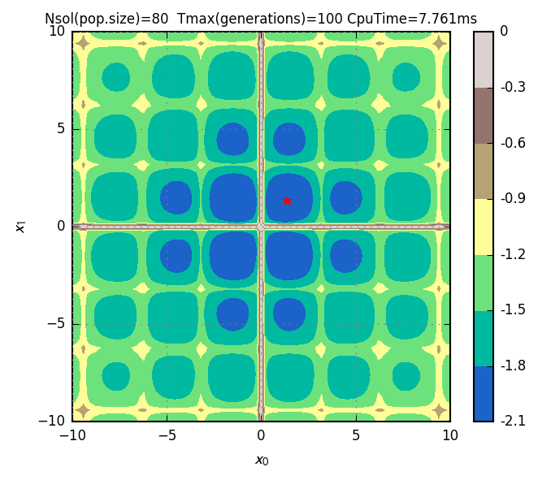

# Goga &ndash; Go Evolutionary/Genetic Algorithm

Goga is a computer library for developing evolutionary algorithms based on the _differential
evolution_ and/or _genetic algorithm_ concepts. The goal of these algorithms is to solve
optimisation problems with (or not) many constraints and many objectives. Also, problems with
mixed-type representations with real numbers and integers are considered by Goga.

[See the documentation](https://godoc.org/github.com/cpmech/goga) for more details (e.g. how to call
functions and use structures).

[](https://godoc.org/github.com/cpmech/goga)

The core algorithms in Goga are well explained in my paper entitled `Parallel evolutionary algorithm for constrained single and multi objective optimisation` which was rejected (due to silly reasons such as `too long`) from _IEEE Transactions on Evolutionary Computation_ but accepted in _Applied Soft Computing_.

The original version for IEEE contains all the equations and is nicely formatted. You can get them freely from here:

1. [Part I: Methods, single and two-objective test cases](doc/goga-ieee-part1.pdf)
2. [Part II: Multi/many-objective test cases and applications](doc/goga-ieee-part2.pdf)

The shorter and slightly improved (published) version is also freely availabe from here:

3. [Summary of GOGA Algorithms](doc/goga.pdf); see also [1, 2]

## Examples

[Check out more examples here](https://github.com/cpmech/goga/blob/master/examples/README.md)

<div id="container">
<p></p>
Output of cross-in-tray.go
</div>

```go
// objective function
func fcn(f, g, h, x []float64, y []int, cpu int) {
	f[0] = -0.0001 * Pow(Abs(Sin(x[0])*Sin(x[1])*Exp(Abs(100-Sqrt(Pow(x[0], 2)+Pow(x[1], 2))/Pi)))+1, 0.1)
}

// main function
func main() {

	// problem definition
	nf := 1 // number of objective functions
	ng := 0 // number of inequality constraints
	nh := 0 // number of equality constraints

	// the solver (optimiser)
	var opt goga.Optimiser
	opt.Default()                    // must call this to set default constants
	opt.FltMin = []float64{-10, -10} // must set minimum
	opt.FltMax = []float64{+10, +10} // must set maximum
	opt.Nsol = 80
	opt.Nsamples = 100

	// initialise the solver
	opt.Init(goga.GenTrialSolutions, nil, fcn, nf, ng, nh)

	// solve problem
	opt.RunMany("", "", false)

	// stat
	opt.PrintStatF(0)
}
```

## Installation

1 Install dependencies:

Goga depends on the [Gosl Go Scientific Library](https://github.com/cpmech/gosl), therefore, please
install Gosl first.

2 Install Goga:

```
go get github.com/cpmech/goga
```

## Documentation

Here, we call _user-defined_ types as _structures_. These are simply Go `types` defined as `struct`.
Some may think of these _structures_ as _classes_. Goga has several global functions as well and
tries to avoid complicated constructions.

An allocated structure is called here an **object** and functions attached to this object are called
**methods**. The variable holding the pointer to an object is always named **o** in Goga (e.g.
like `self` or `this`).

Some objects need to be initialised before usage. In this case, functions named `Init` have to be
called (e.g. like `constructors`).

## Bibliography

Goga is included in the following works:

1. Pedroso DM, Bonyadi MR, Gallagher M (2017) Parallel evolutionary algorithm for single and multi-objective optimisation: differential evolution and constraints handling, Applied Soft Computing http://dx.doi.org/10.1016/j.asoc.2017.09.006
2. Pedroso DM (2017) FORM reliability analysis using a parallel evolutionary algorithm, Structural Safety 65:84-99 http://dx.doi.org/10.1016/j.strusafe.2017.01.001

## Authors and license

See the AUTHORS file.

Unless otherwise noted, the Goga source files are distributed under the BSD-style license found in the LICENSE file.
