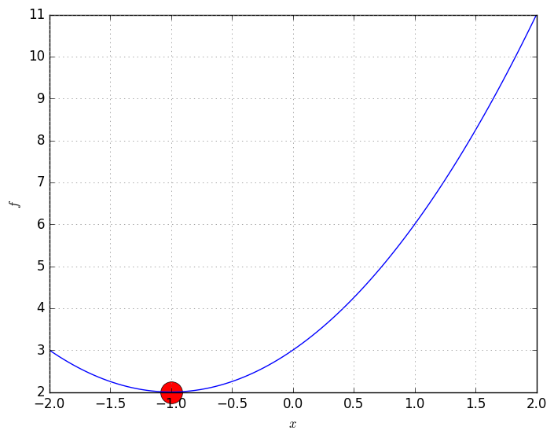
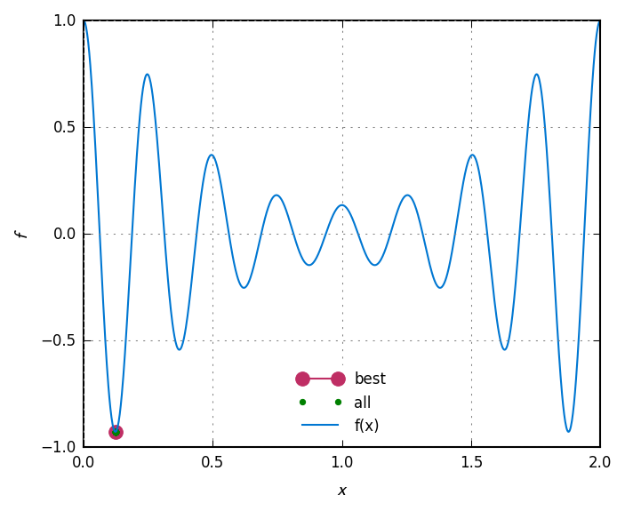

# Goga &ndash; examples

## Summary
0. Simple curves
1. Constrained one-objective problems
2. Unconstrained two-objective problems
3. Constrained two-objective problems
4. Constrained and unconstrained three-objective problems
5. Unconstrained many-objectives problems
6. Truss shape and topology optimisation
7. Economic emission load dispatch


# 0 Simple curves

Goga can use two types of objective functions:

(A) the higher-level one: MinProb\_t which takes the vector of random variables x and returns
  the objectives values in f. It may also return the inequality constraints in g and the
  equality constraints in h. It also accepts integer random variables in y

(B) the lower-level one: ObjFunc\_t which takes the pointer to a candidate solution object
  (Solution) and fills the Ova array in this object with the objective values. In this method
  the vector of random variables x is stored as Flt

Both functions take the cpu number as input if that's necessary (rarely)

The functions definitions of each case are shown below

ObjFunc\_t defines the objective fuction
  `type ObjFunc_t func(sol *Solution, cpu int)`

MinProb\_t defines objective functon for specialised minimisation problem
  `type MinProb_t func(f, g, h, x []float64, y []int, cpu int)`

## Curve 1

```go
// case A: finding the minimum of 2.0 + (1+x)²
func fcnA(f, g, h, x []float64, y []int, cpu int) {
	f[0] = 2.0 + (1.0+x[0])*(1.0+x[0])
}

// case B: finding the minimum of
func fcnB(sol *goga.Solution, cpu int) {
	x := sol.Flt
	sol.Ova[0] = 2.0 + (1.0+x[0])*(1.0+x[0])
}

// main function
func main() {

	// problem definition
	nf := 1 // number of objective functions
	ng := 0 // number of inequality constraints
	nh := 0 // number of equality constraints

	// the solver (optimiser)
	var opt goga.Optimiser
	opt.Default()              // must call this to set default constants
	opt.FltMin = []float64{-2} // must set minimum
	opt.FltMax = []float64{2}  // must set maximum

	// initialise the solver
	useMethodA := false
	if useMethodA {
		opt.Init(goga.GenTrialSolutions, nil, fcnA, nf, ng, nh)
	} else {
		opt.Init(goga.GenTrialSolutions, fcnB, nil, nf, ng, nh)
	}

	// solve problem
	opt.Solve()

	// print results
	xBest := opt.Solutions[0].Flt[0]
	fBest := 2.0 + (1.0+xBest)*(1.0+xBest)
	io.Pf("xBest    = %v\n", xBest)
	io.Pf("f(xBest) = %v\n", fBest)

	// plotting
	fvec := []float64{0} // temporary vector to use with fcnA
	xvec := []float64{0} // temporary vector to use with fcnA
	X := utl.LinSpace(-2, 2, 101)
	F := utl.GetMapped(X, func(x float64) float64 {
		xvec[0] = x
		fcnA(fvec, nil, nil, xvec, nil, 0)
		return fvec[0]
	})
	plt.Reset(true, nil)
	plt.PlotOne(xBest, fBest, &plt.A{C: "r", M: "o", Ms: 20, NoClip: true})
	plt.Plot(X, F, nil)
	plt.Gll("$x$", "$f$", nil)
	plt.Save("/tmp/goga", "simple01")
}
```

Source code: <a href="simple/simple01.go">simple/simple01.go</a>

<div id="container">
<p></p>
Output of simple01.go
</div>

## Curve 2

```go
// objective function
func fcn(f, g, h, x []float64, y []int, cpu int) {
	f[0] = Cos(8*x[0]*Pi) * Exp(Cos(x[0]*Pi)-1)
}

// main function
func main() {

	// problem definition
	nf := 1 // number of objective functions
	ng := 0 // number of inequality constraints
	nh := 0 // number of equality constraints

	// the solver (optimiser)
	var opt goga.Optimiser
	opt.Default()             // must call this to set default constants
	opt.FltMin = []float64{0} // must set minimum
	opt.FltMax = []float64{2} // must set maximum

	// initialise the solver
	opt.Init(goga.GenTrialSolutions, nil, fcn, nf, ng, nh)

	// solve problem
	opt.Solve()

	// auxiliary
	fvec := []float64{0} // temporary vector to use with fcn
	xvec := []float64{0} // temporary vector to use with fcn

	// print results
	xBest := opt.Solutions[0].Flt[0]
	xvec[0] = xBest
	fcn(fvec, nil, nil, xvec, nil, 0)
	fBest := fvec[0]
	io.Pf("xBest    = %v\n", xBest)
	io.Pf("f(xBest) = %v\n", fBest)

	// generate f(x) curve
	X := utl.LinSpace(opt.FltMin[0], opt.FltMax[0], 1001)
	F := utl.GetMapped(X, func(x float64) float64 {
		xvec[0] = x
		fcn(fvec, nil, nil, xvec, nil, 0)
		return fvec[0]
	})

	// plotting
	plt.Reset(true, nil)
	plt.PlotOne(xBest, fBest, &plt.A{L: "best", C: "#bf2e64", M: ".", Ms: 15, NoClip: true})
	opt.PlotAddFltOva(0, 0, opt.Solutions, 1, &plt.A{L: "all", C: "g", Ls: "none", M: ".", NoClip: true})
	plt.Plot(X, F, &plt.A{L: "f(x)", C: "#0077d2"})
	plt.Gll("$x$", "$f$", nil)
	plt.Save("/tmp/goga", "simple02")
}
```

Source code: <a href="simple/simple02.go">simple/simple02.go</a>

<div id="container">
<p></p>
Output of simple02.go
</div>


# 1 Constrained one-objective problems

Source code: <a href="01-one-obj/one-obj.go">one-obj.go</a>


# 2 Unconstrained two-objective problems

Source code: <a href="02-two-obj/two-obj.go">two-obj.go</a>


# 3 Constrained two-objective problems

Source code: <a href="03-two-obj-ct/two-obj-ct.go">two-obj-ct.go</a>


# 4 Constrained and unconstrained three-objective problems

Source code: <a href="04-three-obj/three-obj.go">three-obj.go</a>


# 5 Unconstrained many-objectives problems

Source code: <a href="05-many-obj/many-obj.go">many-obj.go</a>


# 6 Truss shape and topology optimisation

Source code: <a href="06-truss/topology.go">topology.go</a>
and <a href="06-truss/femsim.go">femsim.go</a>


# 7 Economic emission load dispatch

Source code: <a href="07-eed/ecoemission.go">ecoemission.go</a>
and <a href="07-eed/generators.go">generators.go</a>
